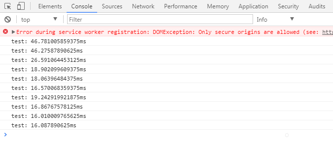

# Vue/React performance example

Click below online example links, and open browser developer tools, Click `+1` button, see console :)


## Vue online example
[Vue](https://suhaotian.github.io/FE_Benchmark/vue)

Test output:


## React 16 online example
[React 16](https://suhaotian.github.io/FE_Benchmark/react)

Test output:


## React 15 online example
[React 15](https://suhaotian.github.io/FE_Benchmark/react15)

Test output:



## How to build your owns

```bash
npm install && npm run prepare
npm run build && npm run copy
```

Output files in build diectory

## How to deploy to github page

```bash
# deploy
npm run publish
```

## Tools

* create-react-app
* vue-cli

## Why have this ?
Compares to [Juzoom/FE_Benchmark](https://github.com/Juzoom/FE_Benchmark).
