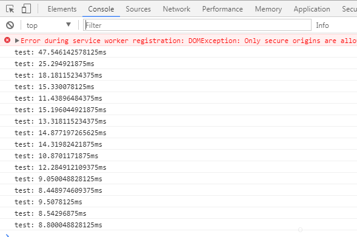
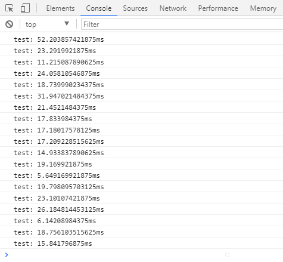

# Vue/React performance example

Click below links, and open browser developer tools, Click `+1` button, see console :)

Compare to [Juzoom/FE_Benchmark](https://github.com/Juzoom/FE_Benchmark)

## React online example
[React](https://suhaotian.github.io/FE_Benchmark/react)

Test output:



## Vue online example
[Vue](https://suhaotian.github.io/FE_Benchmark/vue)

Test output:



## How to build your owns

```bash
npm install && npm run prepare
npm run build && npm run copy
```

Output files in build diectory

## How to deploy to github page

```bash
# deploy
npm run publish
```

## Tools

* create-react-app
* vue-cli

